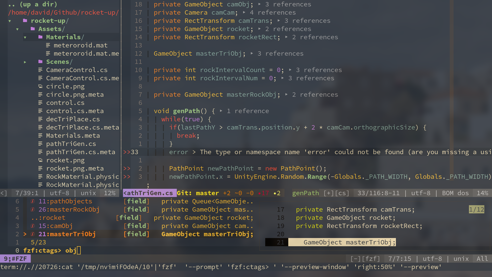

# 我的NeoVim配置文件 (一个Colemak键位布局用户的NeoVim配置)

#### [English Ver.](./README.md)



**请不要**只复制配置文件，而不看其内容! 请至少阅读本自述文件!

## 安装后, 您需要:

- [ ] 安装 `pynvim` (pip)
- [ ] 安装 `nodejs`
- [ ] 安装 nerd-fonts (此选项为可选，但使用nerd-font后，看起来真的不错)

## 安装后，你可能需要做:

#### 首先
- [ ] 执行 `:checkhealth`

#### 配置 `Python` 路径
- [ ]  确保你有Python
- [ ] 编辑 `_machine_specific.vim` 进行配置

#### 用于 Code AutoComplete (coc 一款代码自动补全插件)
Python:
- [ ] 执行 `pip3 install flake8` (用于代码检查)

#### 用于函数/类/变量列表:
- [ ] 安装 `ctags` 用于显示函数/类/变量列表

#### 用于输入ASCII艺术字
- [ ] 安装 `figlet`

## `NORMAL` (`COMMAND`) 模式的键盘快捷键
### 1 基本命令
#### 1.1 最基础的
**`k`** : 切换到 **`INSERT`** :(插入) 模式, 等价于默认快捷键 `i`

**`Q`** : 退出当前vim窗口, 等价于默认快捷键 `:q`

**`S`** : 保存当前文件, 等价于默认快捷键 `:w`

**_注意_**

  由于`i`键已经被映射为`k`键，所以每个涉及到`i`的命令(组合)都应该使用`k`(例如，`ciw`应该改为`ckw`)

#### 1.2 重新映射的光标移动

| 命令       | 功能                    | 等价于 (QWERTY键位布局) |
|------------|-------------------------|-------------------------|
| `u`        | 光标向上移动一行        | `k`                     |
| `e`        | 光标向下移动一行        | `j`                     |
| `n`        | 光标向左移动            | `h`                     |
| `i`        | 光标向右移动            | `l`                     |
| `U`        | 光标向上移动5行         | `5k`                    |
| `E`        | 光标向下移动5行         | `5j`                    |
| `N`        | 光标移动至行首          | `0`                     |
| `I`        | 光标移动至行尾          | `$`                     |
| `Ctrl` `u` | 不移动光标，向上滚屏5行 | `Ctrl` `y`              |
| `Ctrl` `e` | 不移动光标，向下滚屏5行 | `Ctrl` `e`              |
| `h`        | 光标移动至单词末尾      | `e`                     |

#### 1.3 重新映射的编辑器命令
| 快捷键 | 所执行操作 |
|--------|------------|
| `l`    | 撤销       |

#### 1.4 其他需要知道的命令
| 快捷键  | 所执行操作           |
|---------|----------------------|
| `<C-i>` | 跳转至下一个光标位置 |
| `<C-o>` | 跳转至上一个光标位置 |
| `<C-a>` | 将光标后的数字增加1  |
| `<C-x>` | 将光标后的数字减少1  |
| `z=`    | 显示单词拼写建议     |
| `H`     | 将两行合并为一行     |
| `<`     | 减少缩进             |
| `>`     | 增加缩进             |


### 2 窗口管理
#### 2.1 分屏
| 命令  | 功能                                       |
|-------|--------------------------------------------|
| `su`  | 新建一个水平分割的窗口，放置当前窗口下方   |
| `se`  | 新建一个水平分割的窗口，放置当前窗口上方   |
| `sn`  | 新建一个垂直分割的窗口，放置在当前窗口左侧 |
| `si`  | 新建一个垂直分割的窗口，放置在当前窗口右侧 |
| `sv`  | 设置两个分屏为垂直分割                     |
| `sh`  | 设置两个分屏为水平分割                     |
| `srv` | 将当前分屏设置为垂直分割                   |
| `srh` | 将当前分屏设置为水平分割                   |

#### 2.2 在窗口（分屏）之间移动光标
| Shortcut        | Action                 |
|-----------------|------------------------|
| `<SPACE>` + `w` | 将光标移动到下一个窗口 |
| `<SPACE>` + `n` | 将光标移动到左边的窗口 |
| `<SPACE>` + `i` | 将光标移动到右边的窗口 |
| `<SPACE>` + `u` | 将光标移动到上边的窗口 |
| `<SPACE>` + `e` | 将光标移动到下边的窗口 |

#### 2.3 调整窗口大小
使用方向键调整当前窗口大小。

## 插件
#### COC (一款代码自动补全插件)
| Shortcut    | Action                          |
|-------------|---------------------------------|
| `Space` `y` | 获取(yank)(vim的剪切板)历史列表 |
| `gd`        | 跳转至定义                      |
| `gr`        | 列出引用                        |
| `gi`        | 列出实现                        |
| `gy`        | 跳转至类型定义                  |

#### NERDTree
| Shortcut          | Action       |
|-------------------|--------------|
| `tt`              | 开关NerdTree |
| `,` (in NERDTREE) | 开关菜单     |

#### Vista.vim
键入`T`(`Shift`+`t`)打开函数/类/变量列表。

键入`Ctrl`+`t`打开函数/类/变量查找窗口。

键入`q`退出Vista.vim

#### FZF (模糊查找文件器)
| 快捷键     | 操作    |
|------------|---------|
| `Ctrl` `p` | 打开FZF |
| `Ctrl` `u` | 上一项  |
| `Ctrl` `e` | 下一项  |

#### Undotree
| 快捷键        | 操作             |
|---------------|------------------|
| `Shift` + `L` | 打开Undotree     |
| `Shift` + `K` | 历史修改的下一项 |
| `Shift` + `J` | 历史修改的上一项 |

#### vim-startify (初始启动界面)
键入`Space`-`s`-`t`以打开`startify`

#### thesaurus_query.vim
键入 `Space`-`t`-`h`查找近义词

#### vim-signiture (书签)
| 快捷键        | 操作                         |
|---------------|------------------------------|
| `m<任意字母>` | 为当前行添加标记             |
| `m/`          | 列出所有标记                 |
| `m<SPACE>`    | 跳转至当前文件中的下一个标记 |

有关更多命令介绍，请参见 [此处](https://github.com/MattesGroeger/vim-bookmarks#usage)

#### vim-table-mode
使用`<Space>tm`(等同于命令:`TableModeToggle<CR>`)开关表格编辑模式。

#### vim-multiple-cursors
| 快捷键     | 操作                    |
|------------|-------------------------|
| `Ctrl`+`k` | 选择下一个单词 (多光标) |
| `Ctrl`+`p` | 选择上一个单词          |
| `Ctrl`+`x` | 跳过这个单词            |
| `Esc`      | 退出多光标              |

#### vim-surround
添加括号(引号等) (`string` -> `"string"`):
```
string
```
键入: `yskw'`:
```
'string'
```

改变括号
```
'string'
```
键入: `cs'"`:
```
"string"
```

#### fzf-gitignore
键入 `Space` `g` `i` 来创建新的`.gitignore`文件

#### vim-calc
键入`Space`+`a`计算当前行中的数学公式。

## 自定义 代码快捷输入
#### Markdown
| 快捷键 | 呈现效果       |
|--------|----------------|
| `,n`   | ---            |
| `,b`   | 文本 **加粗**  |
| `,s`   | 文本~~中划线~~ |
| `,i`   | 文本 *斜体*    |
| `,d`   | `代码块`       |
| `,c`   | 大 `代码块`    |
| `,m`   | - [ ] 复选框   |
| `,p`   | 图片           |
| `,a`   | [超链接]()     |
| `,1`   | # 标题1        |
| `,2`   | ## 标题2       |
| `,3`   | ### 标题3      |
| `,4`   | #### 标题4     |
| `,l`   | --------       |

`,f` 跳转到至下一个 `<++>` (占位符)

`,w` 跳转至下一个 `<++>` (占位符) 然后帮你键入`Enter`


## 其他有用的东西
#### 键入 `<SPACE>fd` 高亮附近重复的单词

#### 键入 `tx` 然后输入你想要的
`tx QQ-Group :\n823167016<Enter>`
```
  ___   ___         ____
 / _ \ / _ \       / ___|_ __ ___  _   _ _ __    _
| | | | | | |_____| |  _| '__/ _ \| | | | '_ \  (_)
| |_| | |_| |_____| |_| | | | (_) | |_| | |_) |  _
 \__\_\\__\_\      \____|_|  \___/ \__,_| .__/  (_)
                                        |_|
  ___ ____  _____ _  __ _____ ___  _  __
 ( _ )___ \|___ // |/ /|___  / _ \/ |/ /_
 / _ \ __) | |_ \| | '_ \ / / | | | | '_ \
| (_) / __/ ___) | | (_) / /| |_| | | (_) |
 \___/_____|____/|_|\___/_/  \___/|_|\___/
```

